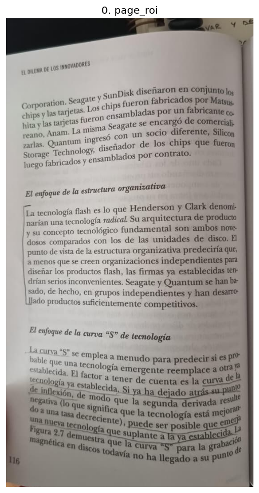
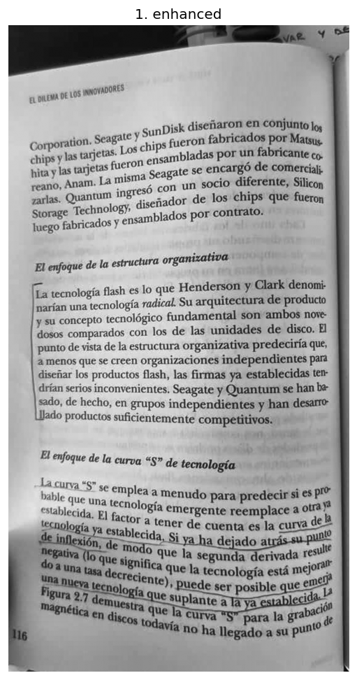
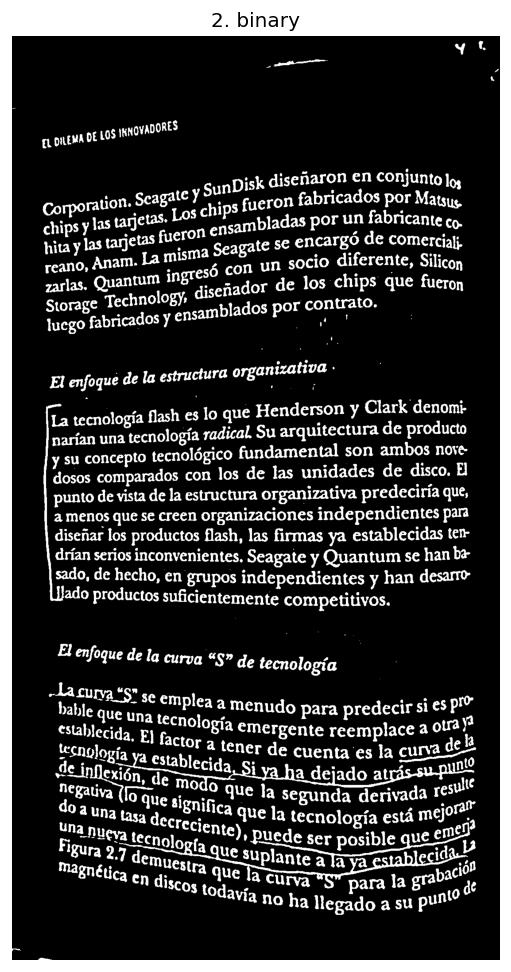
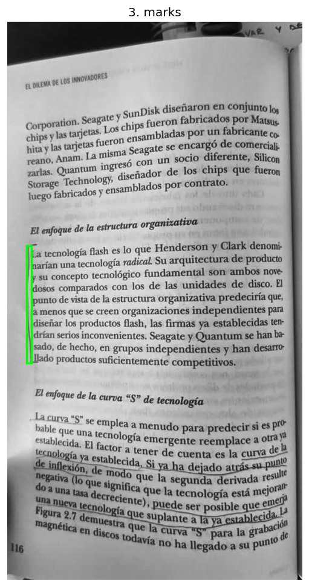

# book_extractor

API REST que recibe fotos de páginas de libros, detecta fragmentos marcados manualmente con `[]` en el margen externo y extrae el texto con OCR.

## Requisitos

- Python >= 3.11
- [uv](https://docs.astral.sh/uv/) instalado
- Tesseract OCR instalado en el sistema (si `OCR_PROVIDER=tesseract`)

## Setup

```bash
uv sync --extra dev
cp .env.example .env
```

## Correr la API

```bash
uv run book-extractor
# o equivalente:
uv run uvicorn app.main:app --reload
```

### Solución errores import open cv 

```bash
uv sync --extra dev
```
Ctrl+Shift+P → "Python: Select Interpreter" → elegir .venv\Scripts\python.exe.
Ctrl+Shift+P → "Developer: Reload Window"

La API queda en `http://localhost:8000` y expone `POST /extract` y `GET /health`.

## Pipeline de procesamiento de imagen

Las fotos llegan tomadas con celular: vienen comprimidas, con luz despareja,
la página curvada, y con todo lo que rodea al libro dentro del cuadro
(escritorio, dedos, la otra página, cuadernos, sombras). Antes de aplicar OCR,
la imagen pasa por cuatro etapas que progresivamente aíslan lo que importa —el
texto de la página y las marcas hechas a mano— y descartan el resto.

### 1. ROI de la página

El primer problema es que la foto contiene mucho más que la página de interés.
Cualquier procesamiento posterior sobre la imagen completa se contaminaría con
ese ruido externo, así que primero se recorta la página.

La idea es que la página de interés es la mancha de texto impreso más grande y
prominente del cuadro. En vez de buscar bordes de papel (poco confiables con
páginas curvadas y fondos variados), se fusiona el texto en bloques sólidos y se
toma el de mayor área: esa es la columna principal de texto. A su alrededor se
agrega un margen, porque ahí es donde van los corchetes que queremos detectar,
pero ese margen se limita para no invadir la otra página del libro cuando está
en el cuadro. El resultado es un recorte centrado en una sola página, con sus
márgenes, libre del entorno.



### 2. Reescalado y CLAHE

Sobre el recorte ya limpio se prepara la imagen para poder separar tinta de
papel de forma confiable.

Primero se pasa a escala de grises (el color no aporta para distinguir texto) y
se reescala a mayor resolución, porque las fotos de celular vienen comprimidas
y un poco de resolución extra ayuda a que los trazos finos —subrayados y
corchetes a lápiz— no se pierdan al binarizar.

Después se aplica **CLAHE** (ecualización de histograma adaptativa con límite de
contraste). El problema que resuelve es la iluminación despareja: una foto de
una página curva tiene zonas más iluminadas y otras en sombra, y un umbral
global fallaría (quemaría una parte y dejaría la otra ilegible). CLAHE realza el
contraste de manera *local*, por regiones, de modo que el texto resalta sobre el
fondo de forma pareja en toda la página independientemente de la luz que recibió
cada zona.



### 3. Binarización

Con el contraste ya normalizado, se reduce la imagen a dos valores: marca/texto
contra fondo. Esto es lo que permite razonar geométricamente sobre los trazos en
la etapa siguiente.

Se usa **umbralización adaptativa**: en vez de un único umbral para toda la
imagen, se decide píxel a píxel comparando contra el promedio de su vecindad.
Esto vuelve a atacar la iluminación despareja y, sobre todo, la curvatura de la
página, que hace que el "blanco" del papel no sea el mismo en todos lados.

Además se combina con una máscara de papel: las zonas oscuras que igual entraron
al recorte (un cuaderno, un dedo, una sombra del borde) se descartan, porque al
binarizarlas generarían trazos falsos que después se confundirían con marcas. Se
distinguen de la tinta por un criterio simple: el texto y las marcas son zonas
oscuras *rodeadas* de papel, mientras que las intrusiones externas tocan el
borde de la imagen.



### 4. Encontrar las marcas

Sobre la imagen binaria se buscan las dos marcas que el lector hace a mano, y se
las distingue del texto impreso por su **geometría**, no por su intensidad (a esa
altura todo es blanco sobre negro).

- **Subrayado**: un trazo horizontal largo, fino y continuo, con texto justo
  encima. El texto impreso no forma corridas horizontales tan largas e
  ininterrumpidas, así que esa forma alargada lo delata.
- **Corchete `[` / `]`**: un trazo vertical alto (a escala de párrafo) y fino,
  dibujado en el margen, con brazos cortos hacia un solo lado y el lado externo
  (el margen) prácticamente vacío. Esa combinación —alto, fino, con brazos
  asimétricos y margen libre— lo separa de letras y de líneas de texto.

Para aislar cada tipo de marca se usan operaciones morfológicas con núcleos
orientados (uno horizontal para subrayados, uno vertical para corchetes), que
conservan los trazos con esa orientación y disuelven el resto. Cada marca
detectada queda descrita por su *bounding box*, que luego se usa para recortar el
fragmento de texto a enviar al OCR.

En verde se marcan los corchetes detectados (los subrayados, en rojo, vienen
desactivados por defecto):



## Tests

```bash
uv run pytest
```

## Variables de entorno

Ver `.env.example`. Provider OCR configurable: `tesseract` o `google_vision`.

## Desplegar tesseract
https://github.com/naptha/tesseract.js#tesseractjs

https://github.com/tesseract-ocr/tesseract
